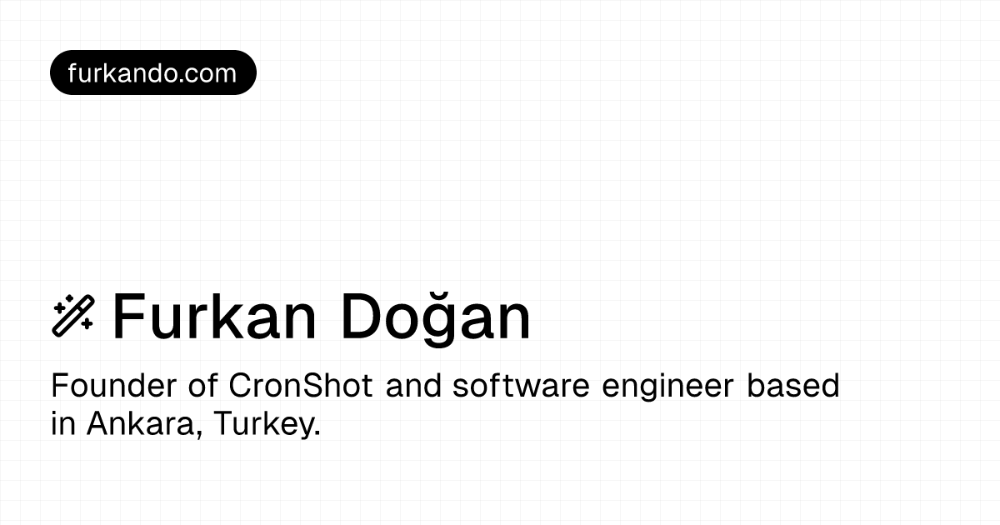

# [furkando.com](https://furkando.com)

[](https://vercel.com/frkndo/furkando-com)
[](htts://github.com/furkando/furkando.com/blob/master/LICENSE)



<br>
<br>

My personal homepage built with Next.js, Tailwind CSS, and Shadcn UI.

## Overview

- `/` — Home page.
- `/[slug]` — Static pre-rendered pages using [Contentful](https://www.contentful.com). (e.g. `/stack`)
- `/writing` — Writing page.
- `/writing/[slug]` — Static pre-rendered writing pages using [Contentful](https://www.contentful.com).
- `/journey` — Journey page.
- `/bookmarks` — Bookmarks page.
- `/bookmarks/[slug]` — Static pre-rendered bookmarks pages using [Raindrop](https://raindrop.io/).
- `/bookmarks.xml` — Bookmarks XML feed.
- `/api` — API routes.

## Running Locally

```bash
$ git clone https://github.com/furkando/furkando.com.git
$ cd furkando.com
$ yarn i
$ yarn dev
```

Create a `.env` file similar to [`.env.example`](https://github.com/furkando/furkando.com/blob/master/.env.example).

## Tech Stack

- [Next.js](https://nextjs.org)
- [Tailwind CSS](https://tailwindcss.com)
- [shadcn/ui](https://ui.shadcn.com)
- [Contentful](https://www.contentful.com)
- [Raindrop](https://raindrop.io)
- [Supabase](https://supabase.com)
- [Vercel](https://vercel.com)